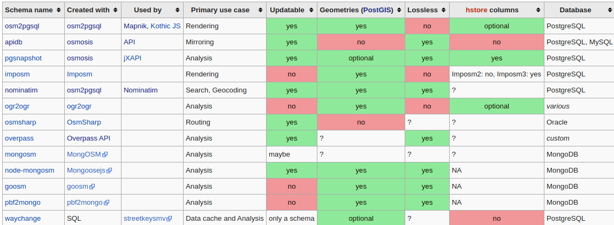
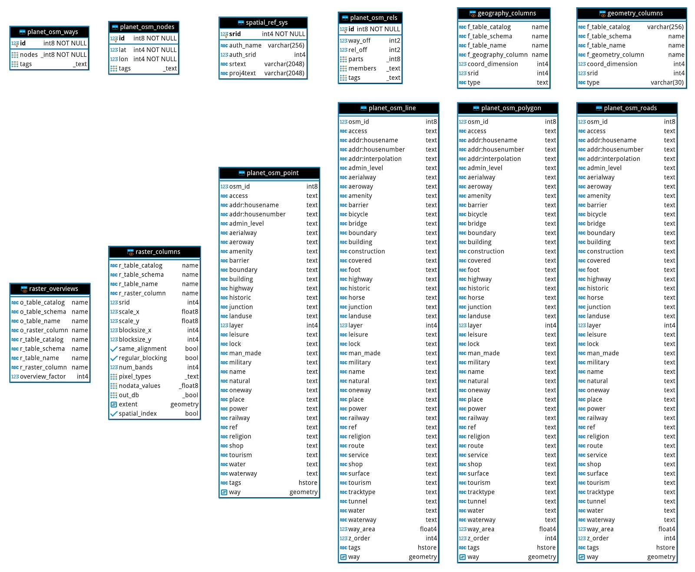
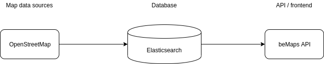

# OSM Researching Notes

## OSM là gì?
OSM là một dự án mã nguồn mở (open-source project) cung cấp các công cụ phục vụ cho việc tạo và chia sẻ dữ liệu bản đồ. Dữ liệu bản đồ cung cấp bởi OSM là hoàn toàn miễn phí (non-profit) và có thể được sử dụng để xây dựng các ứng dụng liên quan đến bản đồ.

Code base của các project liên quan đến OSM trên GitHub: https://github.com/openstreetmap

## Cách hoạt động của OSM
Cách hoạt động cơ bản của OSM project như sau:
- Những người đóng góp (contributors) sử dụng các phần mềm chỉnh sửa dữ liệu bản đồ như JOSM và iD (tool được cung cấp bởi OSM) để tạo các thay đổi cho dữ liệu map hiện tại.
- Các thay đổi trên sẽ được submit lên OSM thông qua hệ thống các APIs mà OSM cung cấp.
- OSM sẽ tiếp nhận các thay đổi trên và thực hiện việc lưu trữ các thay đổi đó. OSM thực hiện việc quản lý toàn bộ dữ liệu bản đồ (kích thước khá lớn - trên 30GB cho dữ liệu đã nén). Dữ liệu bản đồ của OSM là mở và và có thể tải xuống miễn phí.
- OSM sẽ cung cấp các công cụ xung quanh để giúp người dùng thao tác trên dữ liệu bản đồ gốc, ví dụ **osm2pgsql** (chuyển đổi dữ liệu bản đồ gốc sang các bảng trong PostgreSQL), **Nominatim** (dùng để search dữ liệu trên bản đồ), **mod_tile** (Apache extension dùng để thực hiện việc serving các map tiles).

> Đối với beMaps OSM sẽ được sử dụng chính trong việc:
> - Lấy dữ liệu nền cho việc xây dựng bản đồ với một số layer cơ bản như Standard Layer và Transport Layer
> - Sử dụng các tool OSM cung cấp để chuyển đổi dữ liệu raw của OSM sang dạng dữ liệu phục vụ cho việc xây dựng ứng dụng

## Cách sử dụng dữ liệu từ OSM
Dữ liệu OSM được sử dụng cho 2 mục đích cơ bản:
- Sử dụng bởi các nhà nghiên cứu hệ thống thông tin địa lý (GIS user) cho việc chỉnh sửa, cập nhật, truy xuất và phân tích các dữ liệu bản đồ
- Sử dụng cho việc phát triển các ứng dụng có dữ dụng dữ liệu bản đồ. Thông thường OSM được sử dụng để xây dựng các layer cơ bản, các layer khác thường được xây dựng dựa trên mục đích của từng ứng dụng cụ thể. 

> Ví dụ đối với beMaps, một số layer quan trọng có thể kể ra là: Transport Layers và POIs Layers, Traffic Layers, ...

## Cách truy xuất dữ liệu từ OSM
Dữ liệu bản đồ từ OSM có thể được export trực tiếp từ OSM website, tuy nhiên có một số giớ hạn sau:
- Không cho phép export dữ liệu với vùng bản đồ quá lớn.
- Không hỗ trợ việc export cho từng vùng, từng nước hoặc từng thành phố
- Hiện tại chỉ hỗ trợ định dạng **.osm**

Dữ liêu bản đồ có thể được truy xuất qua một số nguồn sau:
- Planet OSM: https://planet.openstreetmap.org - cung cấp dữ liệu cho toàn bộ trái đất. Chỉ đưa ra ở đây với mục đích tham khảo, trên thực tế rất ít ứng dụng sử dụng toàn bộ dữ liệu của OSM.
- Overpass API: https://overpass-api.de
- Geofabrik: https://download.geofabrik.de

Các định dạng dữ liệu OSM:
- **XML**: có thể đọc được ở dạng text, khá phổ biến, tuy nhiên kích thước khá lớn do mất khá nhiều bytes để lưu dữ liệu.
- **OSM**: có thể đọc được ở dạng text, định dạng này chỉ được dử dụng cho dữ liệu bản đồ cung cấp bởi OSM. Định dang này phù hợp cho việc nghiên cứu cũng như chỉnh sửa dữ liệu bản đồ.
- **PBF**: dữ liệu dang binary, đã được nén sử dụng chuẩn Protocol Buffers của Google. Định dạng này có kích thước khá nhỏ và có tốc độ đọc/ghi nhanh hơn so với các dạng dữ liệu khác.

> Định dạng **PBF** sẽ được sử dụng chính trong beMaps

Ví dụ về việc tải dữ liệu từ OSM. Chúng ta sẽ sử dụng Geofabrik:
Dữ liệu trên Geofabrik được chia theo từng châu lục và từng quốc gia khác nhau

Ví dụ, dữ liệu cho khu vực châu Á sẽ được truy cập tại đây: https://download.geofabrik.de/asia
Dữ liệu cho Việt Nam nói riêng và các quốc gia khác nói chung sẽ gồm 2 phần chính:
- Dữ liệu hiện tại: https://download.geofabrik.de/asia/vietnam-latest.osm.pbf (khoảng 70MB)
- Dữ liệu cập nhật: https://download.geofabrik.de/asia/vietnam-updates

Dùng lệnh sau để tải dữ liệu từ Geofabrik
```
wget https://download.geofabrik.de/asia/vietnam-latest.osm.pbf
```
Ngoài các công cụ trên, chúng ta có thể sử dụng công cụ được cung cấp bởi Humanitarian OpenStreetMap Team để export dữ liệu cho các khu vực nhỏ hơn, như quận, huyện, thành phố: https://export.hotosm.org

> beMaps sẽ sử dụng nguồn dữ liệu bản đồ chính từ Geofabrik

## OSM API
OSM cung cấp một hệ thống các APIs cho phép các contributors tạo và cập nhật các thay đổi trên dữ liệu bản đồ hiện tại. Các API requests sẽ được gửi đến và được xử lý bởi các servers của OSM.

API documentation: https://wiki.openstreetmap.org/wiki/API_v0.6

> Đối với beMaps, chúng ta không cần quan tâm quá nhiều đến các APIs trên. APIs thường được sử dụng chính bởi các contributors. Ngoài ra các APIs trên được hosted và quản lý bởi OSM, nên việc sử dụng chúng thường có giới hạn. Các APIs này có thể được sử dụng để tìm hiểu về cấu trúc dữ liệu bên dưới của OSM.

## OSM Data Model
Dữ liệu bản đồ OSM được cấu thành từ các features, mỗi feature sẽ được cấu thành từ các **geometries** và các **attributes** (hay còn gọi là metadata).

**Geometries** trong OSM bao gồm: **node**, **way** và **relation**

**Atributes** còn được gọi là **tags**

### Geometries
#### Node
**Node** được dùng để biểu diễn các điểm trên bản đồ thông thường là cách **POIs**. Một node có thể chứa thêm các tags dùng để cung cấp các thông tin liên quan đến node đó. Bên dưới là một số ví dụ về node trong OSM:

Một node cơ bản, không có thông tin metadata (tags). Một node sẽ chứa các thông tin cơ bản như: latitude, longitude, visible, và timestamp (thời gian được update)
```
<node id="1008752931" visible="true" version="1" changeset="6472947" timestamp="2010-11-27T20:20:01Z" user="richlv" uid="47892" lat="21.0179339" lon="105.8432779"/>
```
Node có thể chứa thêm các tags, dùng để biểu diễn cách thông tin khác liên quan đến node như, số nhà, tên đường,...
```
<node id="1008752956" visible="true" version="3" changeset="72909444" timestamp="2019-08-01T17:47:19Z" user="mama_bear" uid="6980194" lat="21.0199102" lon="105.8496639">
  <tag k="addr:country" v="VN"/>
  <tag k="addr:housenumber" v="80a"/>
  <tag k="addr:street" v="Phố Bà Triệu"/>
 </node>
```

#### Way
Các nodes có thể liên kết với nhau để tạo thành các **ways** (ví dụ như một con đường, 1 dòng sông).

Nếu node đầu vào node cuối của một way được liên kết với nhau, ta có một **closed way**. Cấu trúc này có thể được sử dụng để tạo thành các tòa nhà, công viên, hồ nước,...

Ngoài ra way có thể chứa thêm các tags để cung cấp thêm các metadata cần thiết.

Một số ví dụ về way

A closed way:
```
<way id="9566428" visible="true" version="9" changeset="72991951" timestamp="2019-08-04T15:08:38Z" user="TuanIfan" uid="625303">
  <nd ref="74127918"/>
  <nd ref="309602506"/>
  <nd ref="74127919"/>
  <nd ref="5857305469"/>
  <nd ref="309602519"/>
  <nd ref="74127921"/>
  <nd ref="309602531"/>
  <nd ref="74127922"/>
  <nd ref="309602462"/>
  <nd ref="74127918"/>
  <tag k="name" v="Đảo Rùa"/>
  <tag k="name:en" v="Turtle Isle"/>
 </way>
```
A normal way:
```
<way id="9566542" visible="true" version="10" changeset="68385112" timestamp="2019-03-21T19:14:26Z" user="KB Kang" uid="680210">
  <nd ref="1893253381"/>
  <nd ref="1893253440"/>
  <tag k="bridge" v="yes"/>
  <tag k="highway" v="footway"/>
  <tag k="layer" v="1"/>
  <tag k="material" v="wood"/>
  <tag k="name" v="Cầu Thê Húc"/>
  <tag k="name:de" v="Brücke der aufgehenden Sonne"/>
  <tag k="name:en" v="Morning Sunlight Bridge"/>
  <tag k="name:id" v="Jambatan The Huc"/>
  <tag k="name:ko" v="테훅교"/>
  <tag k="name:ru" v="Мост Восходящего солнца"/>
  <tag k="name:vi" v="Cầu Thê Húc"/>
  <tag k="tourism" v="attraction"/>
 </way>
```

#### Relation
Relation được sử dụng để tổ chức các nodes và ways thành một tổng thể nhất quán. Ví dụ hồ Hoàn Kiếm sẽ được bao quanh bởi mốt số con đường nhất định. Relation cũng sẽ chứa các tags dùng để mô tả chi tiết relation đó.

Ví dụ về relation:
```
<relation id="198437" visible="true" version="13" changeset="75008366" timestamp="2019-09-27T12:38:04Z" user="Marc Choisy" uid="8836956">
  <member type="way" ref="9566396" role="outer"/>
  <member type="way" ref="39168425" role="inner"/>
  <member type="way" ref="9566428" role="inner"/>
  <tag k="alt_name" v="Hồ Gươm"/>
  <tag k="alt_name:de" v="Schwertsee"/>
  <tag k="alt_name:en" v="Sword Lake"/>
  <tag k="alt_name:vi" v="Hồ Gươm"/>
  <tag k="name" v="Hồ Hoàn Kiếm"/>
  <tag k="name:de" v="Hoan-Kiem-See"/>
  <tag k="name:en" v="Hoàn Kiếm Lake"/>
  <tag k="name:id" v="Danau Hoan Kiem"/>
  <tag k="name:ja" v="ホアンキエム湖"/>
  <tag k="name:ko" v="호안끼엠 호"/>
  <tag k="name:vi-hani" v="湖還劍"/>
  <tag k="name:zh" v="还剑湖"/>
  <tag k="name:zh-Hans" v="还剑湖"/>
  <tag k="name:zh-Hant" v="還劍湖"/>
  <tag k="natural" v="water"/>
  <tag k="old_name" v="Hồ Lục Thủy"/>
  <tag k="old_name:vi" v="Hồ Lục Thủy"/>
  <tag k="old_name:zh" v="绿水湖"/>
  <tag k="type" v="multipolygon"/>
  <tag k="water" v="lake"/>
  <tag k="wikidata" v="Q1151254"/>
  <tag k="wikipedia" v="vi:Hồ Hoàn Kiếm"/>
 </relation>
```

#### Tags
Được dùng để mô tả chi tiết các thành phần của dữ liệu bản đồ. Tag được cấu thành dưới dạng key-value. Một số loại tags có thể kể ra:
- Tên đường
- Loại đường
- Số nhà
- Chất liệu
- ...

Ví dụ về tags:
```
<tag k="name" v="Hà Nội"/>
<tag k="amenity" v="cafe"/>
<tag k="internet_access" v="wlan"/>
<tag k="tourism" v="hotel"/>
```

## OSM System Architecture 


Cấu trúc hệ thống của OSM là khá phức tạp. Tuy nhiên chúng ta sẽ chỉ tập trung vào một số thành phần quan trọng của hệ thống này. Cụ thể OSM system sẽ được cấu thành từ các thành phần cơ bản sau:

- OSM Geodata store: là một cơ sở dữ liệu quan hệ, thường là  PostgreSQL được dùng để lưu trữ nodes, ways và relations
- OSM APIs: cung cấp các APIs dùng để thực hiện việc cập nhật dữ liệu bản đồ cũng như truy xuất các dữ liệu bản đồ từ OSM server.
- Backend: cung cấp các endpoints cho việc searching, geocoding và reverse-geocoding trên bản đồ.
- Renderers: được dùng để chuyển đổi dữ liệu gốc từ OSM thành các tiles. Các tiles đó sẽ được dùng để thực hiện việc render map trên các môi trường frontend như web browser hoặc mobile application.
- Visualization: Sử dụng dữ liệu từ các renderers để tạo thành các dạn map động (interactive map). Thông thường bao gồm việc tạo và xử lý các map layers.
- Frontend: Là thành phần dùng để tạo lên giao diện người dùng của OpenStreetMap.

### OSM Database
OSM sử dụng hệ cở sở dữ liệu quan hệ PostgreSQL để lưu trữ các dữ liệu bản đồ. Lý do dùng PostgreSQL:
- PostgreSQL hỗ trợ tốt cho việc lưu trữ các dữ liệu dạng geometry (geometric data types).
- PostGIS là một extension cho PostgreSQL được phát triển để tăng khả năng xử lứ các dữ liệu liên quan đến bản đồ như cung cấp các dạng dữ liệu mới cũng như cho phép truy xuất dữ liệu bản đồ trực tiếp qua các database queries.

Reference: https://postgis.net

> beMaps sẽ sử dụng PostgreSQL và PostGIS extension để lưu trữ và truy xuất dữ liệu bản đồ từ OSM

#### osm2pgsql
OSM community phát triển một công cụ để chuyển đổi dữ liệu raw từ OSM sang dạng dữ liệu được lưu trong các bảng của PostgreSQL - **osm2pgsql**. Reference: https://github.com/openstreetmap/osm2pgsql

Các cài đặt phiên bản mới nhất của osm2pgsql
```
mkdir ~/src
cd ~/src
git clone git://github.com/openstreetmap/osm2pgsql.git
cd osm2pgsql

sudo apt install make cmake g++ libboost-dev libboost-system-dev libboost-filesystem-dev libexpat1-dev zlib1g-dev libbz2-dev libpq-dev libgeos-dev libgeos++-dev libproj-dev lua5.2 liblua5.2-dev

mkdir build && cd build
cmake ..

make
sudo make install
```

Sau khi cài đặt chúng ta có thể acccess command - **osm2pgsql*

Trước khi convert dữ liệu chúng ta cần tải dữ liệu raw từ OSM, ví dụ:
```
wget https://download.geofabrik.de/asia/vietnam-latest.osm.pbf
```
Để convert và insert dữ liệu OSM vào database, chúng ta sử dụng lệnh sau:
```
osm2pgsql -d gis --create --slim  -G --hstore --tag-transform-script ~/src/openstreetmap-carto/openstreetmap-carto.lua -C 2500 --number-processes 1 -S ~/src/openstreetmap-carto/openstreetmap-carto.style ~/vietnam-latest.osm.pbf
```
Quá trình này tiêu tốn khá nhiều tài nguyên hệ thống như CPU, RAM và Disk I/O. Thông thường để import toàn bộ dữ liệu Việt Nam chúng ta cần vài chục phút đến 1 hoặc 2 tiếng, phụ thuộc vào cấu hình máy.

Giải thích command phía trên:
```
-d gis
```
Ở đây chúng ta sẽ định nghĩa tên database mà osm2pgsql sẽ dùng để lưu dữ liệu. Trong ví dụ trên tên database là **gis**

```
--create
```
Load dữ liệu vào một database trống thay vì một database đã tồn tại dữ liệu

```
--slim
```
Database table layout được osm2pgsql sử dụng, ở đấy "slim" layout phù hợp cho quá trình rendering sau này.

```
--hstore
```
Cho phép các tags không tương ứng với bất kì cột nào trong database được sử dụng cho việc rendering

```
--tag-transform-script
```
Script được sử dụng để transform các tags trước khi apply các styles khác nhau cho tags.

```
-C 2500
```
Lượng RAM sẽ được sử dụng cho quá trình import (theo MB). Trong ví dụ trên ta dùng 2.5GB

```
--number-process 1
```
Số core CPU được sử dụng cho quá trình import

Và cuối cùng là file dữ liệu gốc từ OSM - định dạng là .pbf

#### PostgreSQL Tuning
Dữ liệu OSM sau khi được convert và lưu trữ trong PostgreSQL cần được đánh index chi tiết nhằm tăng performance khi thực hiện các công việc như searching. OSM cung cấp một số hướng dẫn nhằm tối ưu hiệu năng của PostgreSQL - https://wiki.openstreetmap.org/wiki/PostgreSQL#Tune_the_database

Tuy nhiên hiện tại be sử dụng Cloud Platform cho việc cấu hình database nên việc tuning PostgreSQL sẽ có những khác biệt. Việc tuning PostgreSQL không nằm trong ph

#### OSM Database Schema


Cơ sở dữ liệu hiện tại là khá phức tạp và phục vụ cho khá nhiều chức năng như: user authentication, changesets, user messaging, user diaries,..

Chúng ta chỉ quan tâm các các bảng dùng để lưu trữ dữ liệu map hiện tại, cụ thể là các bảng sau:
- changesets
- changeset_tags
- current_ways
- current_way_tags
- current_way_nodes
- current_nodes
- current_node_tags
- current_relations
- current_relation_tags

> Cấu trúc dữ liệu hiện tại của OSM sẽ được sử dụng như một tài liệu tham khảo khi thiết kế database cho beMaps

OSM sử dụng nhiều cơ sở dữ liệu khác nhau cho các tác vụ khác nhau đối với dữ liệu map. Một số ví dụ như:
- Database schema cung cấp bởi **osm2pgsql**: được sử dụng chủ yếu cho việc lưu trữ dữ liệu về node, ways, relations. Dữ liệu đó sau đó sẽ được sử dụng để render các tiles.
- Database schema cung cấp bởi **Nominatim**: được sử dụng chủ yếu cho việc searching map data.

Các yếu tố quyết định việc lựa chọn database schema phù hợp:
- Updatable: ứng dụng cần sử dụng các dữ liệu bản đồ mới nhất từ OSM. Dữ liệu sẽ được cập nhật sử dụng **osmChange** (https://wiki.openstreetmap.org/wiki/OsmChange) và không cần import toàn bộ dữ liệu lại từ đầu.
- Geometries: schema cần hỗ trợ việc lưu trữ các dữ liệu dạng geometry hay không?
- Lossless: toàn bộ thông tin từ OSM sẽ được lưu trữ bao gồm: version, thông tin user, changeset và tags. Những thông tin này là cần thiết cho quá trình chỉnh sửa và update dữ liệu bản đồ. Tuy nhiên trong các ứng dụng thực tế, chúng ta chỉ cần dữ liệu ở dạng **lossy**, dữ liệu bản đồ chỉ cần đủ để phục vụ cho việc routing, geocoding,..

Dưới đây là danh sách các database schema thường được sử dụng với OSM data.



Đối với beMaps, chúng ta sẽ sử dụng 2 database schema chính sau:
- **osm2pgsql schema**: database schema này được sử dụng để lưu trữ nodes, ways, relations.
- **Nominatim schema**: dùng để lưu trữ dữ liệu phục vụ cho việc searching.


**osm2pgsql schema**


osm2pgsql sử dụng schema này để lưu trữ dữ liệu sau khi convert dữ liệu OSM gốc sang PostgreSQL. Các bảng chính được sử dụng để lưu từng loại dữ liệu tương ứng với OSM data model.
- osm_point
- osm_nodes
- osm_line
- osm_polygon
- osm_rels (relations)
- osm_roads
- osm_ways

**Nominatim schema**
Nominatim schema khá phức tạp với việc chưa rất nhiều **partitioned tables** được dùng để lưu các dữ liệu phục vụ cho việc searching.
Cấu trúc database của Nominatim có thể tham khảo tại đây: https://github.com/openstreetmap/Nominatim/tree/master/sql

Đối với beMaps, việc sử dụng PostgreSQL hoàn toàn cho việc search sẽ không hiệu quả và thường không mở rộng (scaling) được. Một phương pháp để giải quyết vấn đề này là sử dụng Elasticsearch để cải thiện tốc độ và độ chính xác của quá trình searching.

Elastic hỗ trợ tốt trong việc xử lý các loại dữ liệu liên quan đến bản đồ
https://www.elastic.co/webinars/geospatial-applications-with-elasticsearch



- Dữ liệu từ OSM, sẽ được lọc, chuẩn hóa và index vào Elasticsearch
- Elasticsearch có thể được scale sử dụng các kĩ thuật như **sharding** và **clustering**
- beMaps backend có thể thực hiện các **geographic queries** sử dụng các Elasticsearch index.

### OSM Frontend
OSM frontend được viết sử dụng các ngôn ngữ chính là Ruby (sử dụng Ruby on Rails framework), JavaScript và Perl

Các thành phần chính của OSM frontend bao gồm:
- The front page map
- Data browser
- User diaries
- User messaging
- Friends
- Permissions and roles

Chúng ta chỉ cần quan tâm đến 2 thành phần quan trọng là **front page map** và **data browser**. Các thành phần khác không thực sự phù hợp trong ngữ cảnh của beMaps

#### The front page map

Component này được sử dụng để hiện thị map, thực hiện việc routing và truy xuất các dữ liệu liên quan đến các thành của map như roads, POIs,...

##### Displaying map
Đây là quá trình render các tiles lên các môi trường như web browser. OSM sử dụng một kĩ thuật với tên gọi là **Slippy Map**.

**Slippy Map** sử dụng AJAX để load dữ liệu từ server. Dữ liệu map dược tải xuống từ OSM server ở background sử dụng Javascript (không cần phải tải lại toàn bộ trang). Quá trình này giúp cho việc thực hiện các hành động như zooming và panning trên map trở nên mượt mà hơn (giúp cải thiện trải nghiệm người dùng).

Nhìn chung, **displaying map** là quá trình tạo các tiles và serving các map tiles đó sử dụng **tile server**.

Có khá nhiều công cụ open-source có thể được sử dụng để xây dựng các hệ thống map động (interactive map). Hai công cụ khá phổ biến có thể áp dụng vào beMaps bao gồm:
- **OpenLayers** (https://openlayers.org): được sử dụng để hiển thị các map tiles, các dữ liệu khác như vector data, map markers được lấy từ OpenStreetMap hoặc các nguồn dữ liệu khác như (Bing, MapBox, Satemen,...). OpenLayers có thể được sử dụng để quản lý các layers vào tạo các tương tác (interactions) trên các layer đó. OpenLayers được viết bằng JavaScript, do vậy công cụ này khá phù hợp cho môi trường web.
- **Leaflet** (https://leafletjs.com): Tương tự như OpenLayers, Leaflet là một thư viên JavaScript dùng để tạo các map động. Leaflet có thể được sử dụng để render các map tiles, tạo map markers, tạo các hành động như zooming, panning, scaling,...

##### Routing
Chúng ta sẽ có một section riêng để bàn chi tiết về việc routing trong OSM. Quá trình routing trong OSM được thực hiện sử dụng **OSRM** và **GraphHopper**

**OSRM**: là một công cụ open-source hoàn toàn được viết bằng C++. OSRM cung cấp các toolkit cho việc xây dựng cả backend và frontend để giải quyết vấn đề routing. Các bài toán mà OSRM có thể giải quyết bao gồm:
- Nearest: tìm các điểm lân cận cho một tọa độ cho sẵn (thường là tìm các POIs)
- Route: tìm đường đi nhanh nhất giữa hai tọa độ cho trước.
- Table (distance matrix): tính toán khoảng cách, thời gian, và cách đi nhanh nhất giữa các cặp tọa độ cho trước.
- Match: tìm tọa độ dựa vào tín hiệu GPS
- Trip: giải bài toán Travelling Salesman Problem
- Tile: tạo các Mapbox vector tiles với các thông tin routing đính kèm.

Reference: https://github.com/Project-OSRM/osrm-backend/blob/master/docs/http.md

Một số ví dụ sử dụng OSRM API để tìm đường ngắn nhất giữa hai điểm trên bản đồ.

API cần sử dụng là:
```
GET /route/v1/{profile}/{coordinates}?alternatives={true|false|number}&steps={true|false}&geometries={polyline|polyline6|geojson}&overview={full|simplified|false}&annotations={true|false}
```

Trong đó:

|Option      |Giá trị                                       |Mô tả                                                                    |
|------------|---------------------------------------------|-------------------------------------------------------------------------------|
|alternatives|`true`, `false` (default), or Number         |Search for alternative routes. Passing a number `alternatives=n` searches for up to `n` alternative routes.\*                            |
|steps       |`true`, `false` (default)                    |Returned route steps for each route leg                                        |
|annotations |`true`, `false` (default), `nodes`, `distance`, `duration`, `datasources`, `weight`, `speed`  |Returns additional metadata for each coordinate along the route geometry.      |
|geometries  |`polyline` (default), `polyline6`, `geojson` |Returned route geometry format (influences overview and per step)              |
|overview    |`simplified` (default), `full`, `false`      |Add overview geometry either full, simplified according to highest zoom level it could be display on, or not at all.|
|continue\_straight |`default` (default), `true`, `false`  |Forces the route to keep going straight at waypoints constraining uturns there even if it would be faster. Default value depends on the profile. |
|waypoints   | `{index};{index};{index}...`                |Treats input coordinates indicated by given indices as waypoints in returned Match object. Default is to treat all input coordinates as waypoints.    |

Giả sử chúng ta cần tìm đường ngắn nhất giữa Hồ Hoàn Kiếm và Nhà thờ Lớn, sử dụng request sau:
```
http://router.project-osrm.org/route/v1/driving/105.85239,21.02876;105.85025,21.02703?overview=false&alternatives=true&steps=true
```
Dữ liệu trả về sẽ tương tự như sau
```
{
  "code": "Ok",
  "routes": [
    {
      "distance": 569.5,
      "duration": 252.3,
      "legs": [
        {
          "distance": 569.5,
          "duration": 252.3,
          "steps": [
            ...
            {
              "distance": 8.1,
              "driving_side": "right",
              "duration": 5.8,
              "geometry": "qyi_Ck{`eSMD",
              "intersections": [
                {
                  "bearings": [
                    165,
                    195,
                    345
                  ],
                  "entry": [
                    true,
                    false,
                    true
                  ],
                  "in": 1,
                  "location": [
                    105.850299,
                    21.026969
                  ],
                  "out": 2
                }
              ],
              "maneuver": {
                "bearing_after": 340,
                "bearing_before": 16,
                "location": [
                  105.850299,
                  21.026969
                ],
                "modifier": "straight",
                "type": "turn"
              },
              "mode": "driving",
              "name": "Phố Nhà Chung",
              "weight": 5.8
            },
            {
              "distance": 0,
              "driving_side": "right",
              "duration": 0,
              "geometry": "_zi_Ce{`eS",
              "intersections": [
                {
                  "bearings": [
                    161
                  ],
                  "entry": [
                    true
                  ],
                  "in": 0,
                  "location": [
                    105.850273,
                    21.027038
                  ]
                }
              ],
              "maneuver": {
                "bearing_after": 0,
                "bearing_before": 341,
                "location": [
                  105.850273,
                  21.027038
                ],
                "type": "arrive"
              },
              "mode": "driving",
              "name": "Phố Nhà Chung",
              "weight": 0
            }
          ],
          "summary": "Phố Lê Thái Tổ, Phố Quang Trung",
          "weight": 339.2
        }
      ],
      "weight": 339.2,
      "weight_name": "routability"
    }
  ],
  "waypoints": [
    {
      "distance": 102.32887047821046,
      "hint": "-uFRhv___38AAAAAVQAAAGYBAABLAQAAAAAAAJZP4kFaSjxD_vt8QgAAAAArAAAAZgEAAHMAAADOXAAADipPBrHfQAHmLU8GmN9AAQUA3wt1cxsx",
      "location": [
        105.851406,
        21.028785
      ],
      "name": "Phố Lê Thái Tổ"
    },
    {
      "distance": 2.549732775530881,
      "hint": "rOFRhv___386AAAASwEAAAAAAADXAAAAmKYBQQ0GTkIAAAAAyNQaQjoAAACmAAAAAAAAAGwAAADOXAAAoSVPBt7YQAGKJU8G1thAAQAATxV1cxsx",
      "location": [
        105.850273,
        21.027038
      ],
      "name": "Phố Nhà Chung"
    }
  ]
}

```


